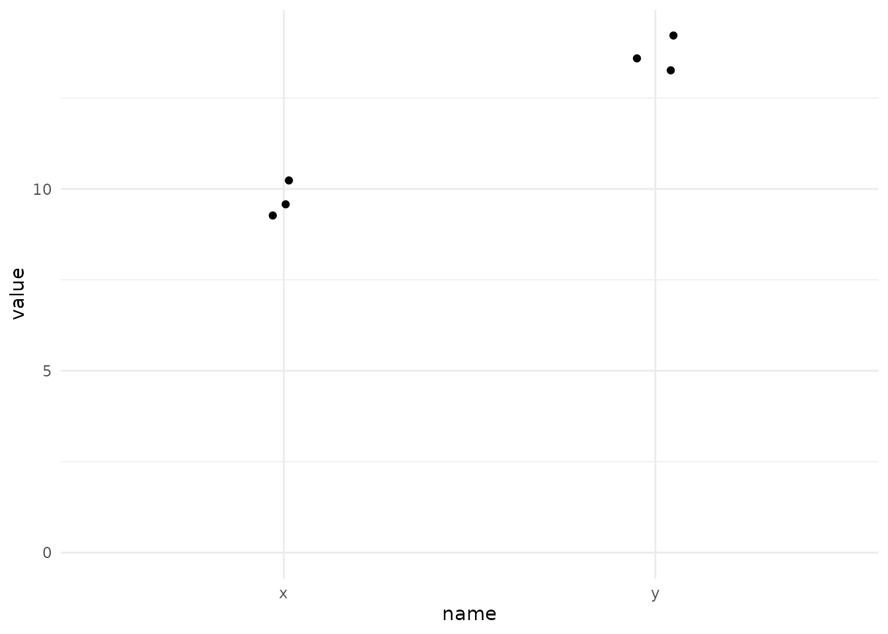

# Stats time!


```r
library(tidyverse)
```

<!-- todo: Motulsky, Intuitive Biostatistics! -->

... the ultimate guide to choosing a hypothesis test.

-   with some recap and new tests

## Lingo

- outcome ~ independent variable(s)

## Compare proportions and counts (outcome: binomial)

## Case-control studies

## Survival analysis (outcome: survival times)

## Compare two distributions (outcome: continuous gaussian)

### Unpaired t-test


```r
t_example <- tibble(
  x = rnorm(3, 10),
  y = rnorm(3, 14) 
) %>%
  pivot_longer(x:y)

t_example %>% 
  ggplot(aes(name, value)) +
  geom_jitter(width = 0.05) +
  expand_limits(y = 0)
```




```r
t.test(value ~ name, data = t_example, var.equal = TRUE)
```

```

	Two Sample t-test

data:  value by name
t = -9.6133, df = 4, p-value = 0.0006546
alternative hypothesis: true difference in means between group x and group y is not equal to 0
95 percent confidence interval:
 -5.264448 -2.904999
sample estimates:
mean in group x mean in group y 
       9.654961       13.739685 
```

```r
model <- lm(value ~ name, data = t_example)
summary(model)
```

```

Call:
lm(formula = value ~ name, data = t_example)

Residuals:
      1       2       3       4       5       6 
-0.4430  0.5734  0.5854 -0.4109 -0.1424 -0.1625 

Coefficients:
            Estimate Std. Error t value Pr(>|t|)    
(Intercept)   9.6550     0.3005  32.135 5.59e-06 ***
namey         4.0847     0.4249   9.613 0.000655 ***
---
Signif. codes:  0 '***' 0.001 '**' 0.01 '*' 0.05 '.' 0.1 ' ' 1

Residual standard error: 0.5204 on 4 degrees of freedom
Multiple R-squared:  0.9585,	Adjusted R-squared:  0.9481 
F-statistic: 92.41 on 1 and 4 DF,  p-value: 0.0006546
```

### Paired t-test

### Nonparametric methods (outcome: continuous nongaussian)

## Compare multiple distributions (outcome: continuous gaussian)

### One-way anova

### Two-way anova

### Comparison to (multiple) linear regression


<https://scientificallysound.org/2017/06/08/t-test-as-linear-models-r/>

## Choose a statistical test

